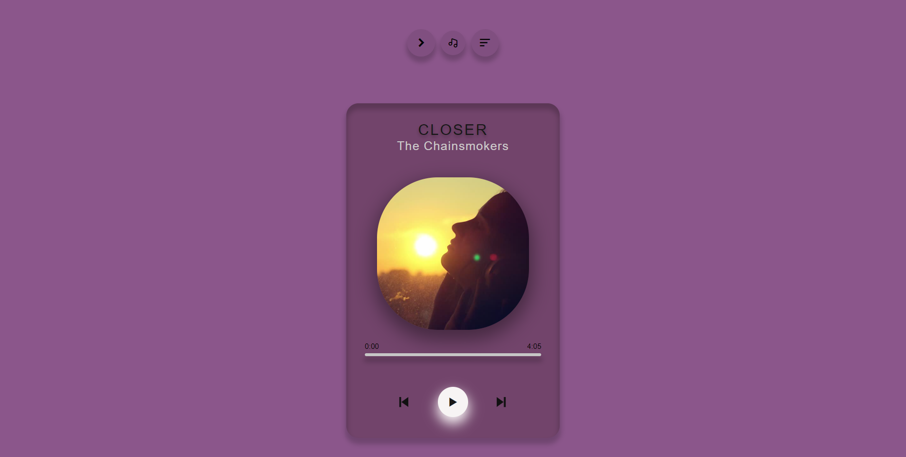

<h1>Music player</h2>

A Web-based Music Player Application.I love the idea of seeing your interactions with your music experiences. So, I decided to create a personal music player
It's a Personal music player in which I have my fav songs that I want .I can also add new songs to it as well if I wish to delete anyone then also.
This is a Simple music player which is capable of playing music files from an internal or external SD card. 

You can Read and Show all the Meta tags of Audo File like Artist, Title,Music Cover in the player.
 
 <h2>Preview</h2>
  

https://shweta-rani1.github.io/Music-Player/
<h3>Clone this repository</h3>

<h2>FEATURES</h2>

-Own playlist

-Able to remove or add songs

-Song can be added as much as you want

-Unlike other music players or streaming apps,you have control over your own content.

-They are free to be encoded,transformed or modified. 

